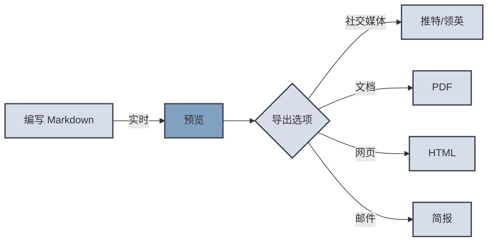

# MarkdownPost

👋 欢迎来到`MarkdownPost`！很高兴见到你！

你只需要专注于内容创作，**MarkdownPost** 帮助你转换为`邮件`、`图片`、`PDF`等格式。

## 快速上手

1. 编写内容：输入 Markdown 文本📝，粘贴图片🏞️
2. 选择主题：挑选一个适合您内容的主题🎨
3. 复制内容：一键复制排版后的内容
4. 粘贴分享：粘贴到电子邮件、聊天软件等任何地方，快速分享

## 使用场景

**MarkdownPost** 的多种输出格式（正在开发中），可以满足不同的使用场景：

| 格式     | 描述                    | 场景        |
|--------|-----------------------|-----------|
| 🖼️ 图片 | 根据 Markdown 生成便于分享的图片 | 社交媒体分享图   |
| 📧 邮件  | 创建可直接嵌入电子邮件的内容        | 新闻简报、文章分享 |
| 📄 PDF | PDF 格式便于保存、分享、打印      | 文章归档、文件传输 |

## 功能亮点

- 💡 **简洁易用:** 实时预览效果，所见即所得。
- 🏞️ **图片上传:** 粘贴图片，自动生成图片链接。
- 🧮 **数学公式:** 支持 $\LaTeX$ 数学公式。
- 📈 **数据可视化:** 使用 Mermaid 语法，轻松创建流程图、序列图等，让数据更加生动。
- 🎨 **多种主题:** 不断更新多种主题以满足不同排版需求。
- 📧 **快速分享:** 一键复制，即可发布在多种平台。
- 📄 **自动适应:** 在邮件中可以自适应窗口宽度，更美观的展示内容。
- 🔒 **数据安全:** 文本和图片完全在浏览器中处理，不会上传到服务器。
- 🌟 **免费开源:** 完全免费使用，欢迎社区贡献。

## 欢迎反馈

欢迎在 [Github Issue](https://github.com/Cyronlee/markdown-post/issues) 中提出你的想法和建议，你的反馈会让 **MarkdownPost**
变得更好！
